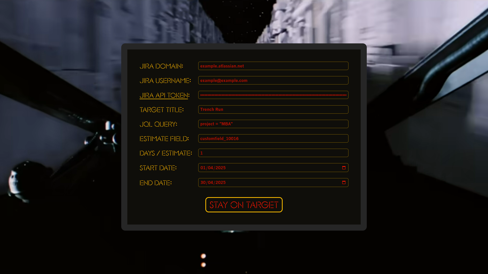
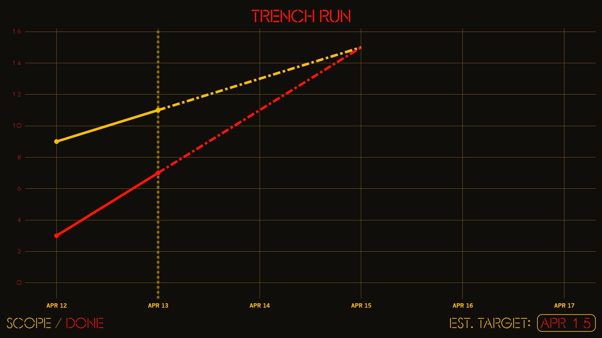

# Stay on Target

Flexible and focussed burn-up chart on top of Jira.

The code is currently a piece of junk, but it'll make the Kessel Run
in less than 12 parsecs ;)






## TODO

* Limit number of API requests made for safety
* Gracefully handle invalid config
* Gracefully handle API failures
* In case of CORS error, remind to disable CORS and set user agent


## Getting Started

### Installation

Install the dependencies:

```bash
make deps
```

### Development

Start the development server with HMR:

```bash
make dev
```

Your application will be available at `http://localhost:5173`.

### Getting around CORS restrictions

The Jira API does not allow requests from other domains (i.e. it has
CORS restrictions), so you'll need to run your browser with CORS
checks disabled and a custom user agent:

```bash
make chrome
```

OR

```bash
make chromium
```

### Setting up Jira for testing

1. Create a Jira project
2. Under `Project Settings -> Features`, enable `Estimation` with `Story Point estimate`
3. Find out the custom field ID for `Story Point estimate` by:
   1. Opening the list of issues
   2. Switching to `JQL` query mode
   3. Start typing `Story Point estimate` to see an autocomplete
      option like `Story Point estimate cf[10016]`
   4. In that case, the estimate field name you configure
      stay-on-target with should be: `customfield_10016`


## Building for Production

Create a production build:

```bash
make build
```


## Deployment

### Serve build directory

```bash
make serve
```

### Docker Deployment

To build and run using Docker:

```bash
docker build -t my-app .

# Run the container
docker run -p 3000:3000 my-app
```

The containerized application can be deployed to any platform that supports Docker, including:

- AWS ECS
- Google Cloud Run
- Azure Container Apps
- Digital Ocean App Platform
- Fly.io
- Railway

### DIY Deployment

If you're familiar with deploying Node applications, the built-in app server is production-ready.

Make sure to deploy the output of `npm run build`

```
├── package.json
├── package-lock.json (or pnpm-lock.yaml, or bun.lockb)
├── build/
│   ├── client/    # Static assets
│   └── server/    # Server-side code
```

---

Built with ❤️ using React Router.
